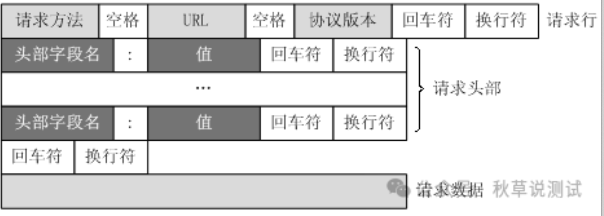
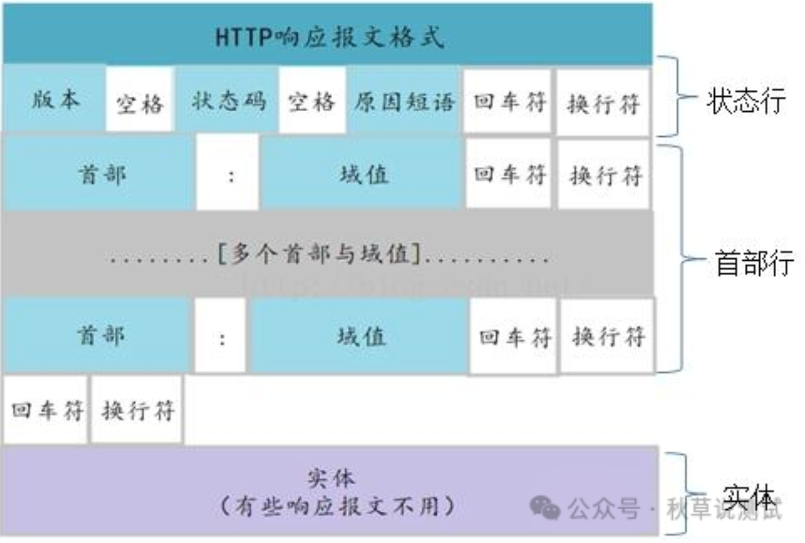
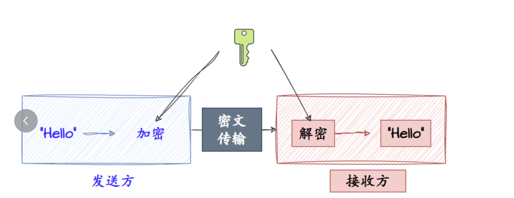
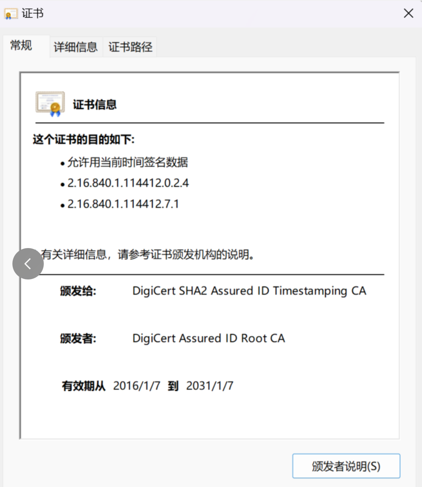
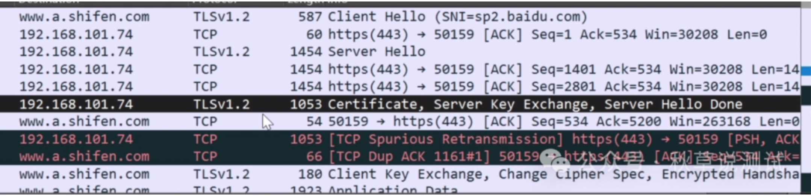
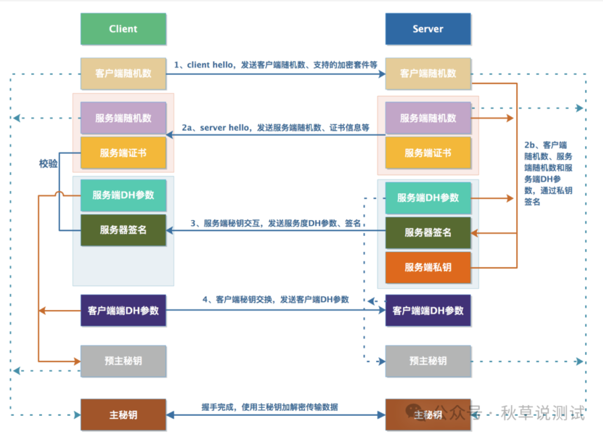

大家现在访问网络，浏览网页，注意一下的话，网址前面基本上都是一个 `https://` 的前缀，这里就是说明这个网址所采用的协议是 https 协议。那么具体应该怎么理解 https 呢？本文我们就力争能清楚地解释明白这个我们目前应该最广的协议。

## **理解HTTP协议**

要解释 https 协议，当然首先应该知道 http 协议。http 协议可以说是现代互联网的基础。在现代网络的 OSI 七层模型中，http 是典型的第 7 层应用层协议。也就是它是基于网络通信的实际应用，比如浏览器呈现网页内容，这就是网络通信的具体应用。

如下图分别是 http 协议的消息请求和响应报文的协议定义格式：



访问百度的请求解析如下：

```html
GET https://www.baidu.com/ HTTP/1.1
#请求方法  URL HTTP协议版本
Host: www.baidu.com
#请求服务器地址
#以下是消息头内容
Connection: keep-alive
#连接方式：长连接
Cache-Control: max-age=0
#请求缓存控制，需确认请求内容是否有修改
Upgrade-Insecure-Requests: 1
#支持https协议
User-Agent: Mozilla/5.0 (Windows NT 10.0; Win64; x64) AppleWebKit/537.36 (KHTML, like Gecko) Chrome/71.0.3578.98 Safari/537.36
#请求客户端，浏览器版本
Accept: text/html,application/xhtml+xml,application/xml;q=0.9,image/webp,image/apng,*/*;q=0.8
#支持的响应内容类型
Accept-Encoding: gzip, deflate, br
#支持的编码类型
Accept-Language: zh-CN,zh;q=0.9,en;q=0.8
#支持的语言
Cookie: BAIDUID=C0A2...
#携带的cookie信息
#未携带请求消息体，body为空
```



响应解析：

```html
HTTP/1.1 200 OK
#协议版本 消息状态码 状态描述
Bdpagetype: 2
Bdqid: 0x8707d7d80001f34e
#自定义消息头
Cache-Control: private
#缓存控制策略
Connection: Keep-Alive
#长连接
Content-Type: text/html;charset=utf-8
#响应内容类型
Date: Sat, 22 Dec 2018 08:54:51 GMT
#响应时间
Expires: Sat, 22 Dec 2018 08:54:51 GMT
#过期失效时间
Server: BWS/1.1
#服务器系统及版本
Set-Cookie: BDSVRTM=372; path=/
Set-Cookie: BD_HOME=1; path=/
Set-Cookie: path=/; domain=.baidu.com
#设置客户端cookie
Strict-Transport-Security: max-age=172800
#严格安全传输，有效时间
X-Ua-Compatible: IE=Edge,chrome=1
#兼容浏览器版本
Content-Length: 191722
#消息体长度
#以下消息体内容
<!Doctype html>
<html xmlns=http://www.w3.org/1999/xhtml><head>
...
```


那这里其实请求的地址 Url 是 `https://www.baidu.com`， 是https协议，为什么这里又说它是 http 协议呢？这两者到底是什么关系？


## HTTPS协议和TLS、SSL

其实 https 协议是指 **HyperText Transfer Protocol over Secure Socket Layer**，也就是基于SSL之上的HTTP协议。

**SSL**(Secure Socket Layer) 指安全套接字层，是互联网鼻祖公司网景（Netscape）提出的为网络通信提供安全性和隐私保护的标准协议。发展到 SSL3.0版本后，标准组织 IETF 对 SSL 协议进行了标准化，并重新命名为 **TLS**(Transport Layer Security，传输层安全)。目前更新到 TLS1.3 版本。

所以说SSL和TLS其实是一脉相承的，可以认为二者其实是不同时期的同一个协议。而HTTPS协议其实就是：

> HTTPS = HTTP + SSL/TLS

为什么需要 https 协议呢？因为http协议本身在传输过程中，传递的信息基本都是透明的，传输过程中的任何节点，其实都可以看到传输的消息体内容。

因此为了安全起见，就有了对传输内容加密的需求，SSL/TLS 协议的作用，其实就是为了保护这个内容安全而推出的。

从 TLS 协议的命名也可以看出，它其实是在 TCP 协议（传输控制协议）的基础上，增加了安全特性的一个协议。

HTTPS 协议基于HTTP协议，所以它还是属于应用层协议，而TLS 是在第四层的TCP协议基础上，一般认为是属于第五层即会话层。

通过TLS，可以实现网络通信传输过程中，通信数据的加密


## 关于加密

那么理解 https 协议，这里也就是要搞清楚 TLS 是怎么对通信数据完成加密的。


### 对称加密

我们正常理解加密，就是通过双方约定的一个规则，也就是通过加密算法，把原始字串变更为一个只有通信双方知道的密文，这样其他人即便知道通信内容，就并不能知道原始的信息。

比如我们看谍战片，传递情报一般都有个重要的东西叫做 **密码本**, 这里密码本其实就是加密算法，也就是**密钥**。

这种加密方式，双方是对等的，对通信内容加密和解密使用的是同一个密钥，因此叫 **对称加密**



但这种加密方式，有一个最大的问题，就是这里的密码本。谍战片中，情报人员舍生忘死也要保护密码本，否则一旦泄露，情报就存在泄露风险。

网络通信也是一样，这里最大的问题，就是这里的密钥如何避免泄露。但只要密钥本身也需要通过网络通信来传输，那么依然不安全。

这个过程好比：

```text
A: 跟你说个秘密，我下面的话你不要直接听，我全部说第几页第几行第几列，你去《红楼梦》找到对应的字连起来读。你回话也告诉我对应字的位置就行
B: 好嘞，《红楼梦》已摆好，你说吧
。。。。
C：我偷听到啦，赶快买本《红楼梦》去...
```


### **非对称加密**

而除了对称加密之外，还有一种加密方式是 **非对称加密**， 这种方式会采用一些特殊的加密算法，生成两份密钥，分为 **公钥** 和 **私钥**, 通过其中一把钥匙加密的内容，只能通过另一把要是才能解密。并且这个算法是很难通过暴力破解逆向还原推导仿冒出另一把钥匙。

类似古代调遣军队的虎符，只有双方严丝合缝对得上才能验证为真。


有了这个机制，就可以把私钥保存在自己这里，并且绝不外传，而公钥可以公告天下，通过网络正常传递，谁都有可能拿到。这样，对方要给我发送加密信息，只要使用公钥加密，而解密只能在我自己这里才能完成。

所以，非对称加密大致的过程就是：

```text
A: 我有点秘密想跟你说, 不能被其他人听到....
 B：稍等，我给你个公钥，你上个锁以后再说给我听。拿到公钥先念下公钥上的字给我看看对不对
 A: 收到公钥，上面写着“我是王大锤”
 B: 对，你收到的就是我给你的公钥，用它上锁吧
 A：公钥加密上锁，打包发给B
 B：取出私钥，打开包裹，阅读内容...
```


相比 **对称加密**，**非对称加密**明显更加安全，但这种方式的缺点是计算量比较大，加解密过程效率不高，速度较慢，所以实际应用中，通常是两种方式结合使用。

也就是 TLS 加密过程：

> 双方会首先通过非对称加密过程，协商出一个用于通信的对称密钥；这个对称密钥的生成都在各自的本地完成，而完成密钥协商后，后方各自都有了一个相同的对称密钥，就可以基于这个相同的密钥进行后续对称加密通信。

因为这个对称密钥是通过非对称加密的方式得到的，所以并不会在双方的通信过程中传递。这样就兼顾了安全和效率。


### 签名和证书

不过用非对称加密，还是存在一个漏洞。

就是在服务器和客户端通信的过程中，通信过程其实会通过大量中间环节，如果存在一个恶意的劫持者，它在收到服务端信息后，想自己假冒服务端，篡改信息后再发给客户端。

这时它其实可以伪装成服务端，自己给客户端发放公钥，拿到客户端的信息后，用自己的私钥解密，再用真正的服务端公钥重新加密，发给服务端。

这个风险其实就是安全领域中的 **中间人攻击** 漏洞。

而为了规避这个问题，需要服务端应该证明自己的身份，然后客户端还可以验证这个身份。因此就有了签名和证书。

签名就是服务端表明自己的身份，拿到公钥的客户端就可以通过签名判断这个发送端是正确的服务器。这里的签名和公钥其实都保存在一个文件中，也就是服务端的签名证书。

而为了防止中间人伪造证书，这时就引入了**CA（Certificate Authority)**，也就是权威的第三方证书颁发机构。这些权威的第三方颁发机构会用私钥对服务端的签名进行加密，这样客户端就可以通过机构的公钥来验证这个签名是否是对应的服务端。验证无误，就可以用证书中携带的公钥来完成和服务端后续的通信协商。




## **HTTPS协议交互过程**

有了上面的基础，我们来具体看一下访问一个 https 网站的具体通信过程。

TLS因为有不同的版本，并且支持多种不同密钥交换和加密算法，所以在通信前，首先要完成使用何种加密算法、用什么密钥生成方式等过程。而 TLS 是基于TCP协议之上的，所以在 TCP 典型的 3次握手完成建链之后，会进行 TLS 的握手建链过程：

- 比如客户端从浏览器访问网站， 这时浏览器会首先发送`Client Hello` 消息到服务器，这个消息中主要包含了客户端支持的`加密套件ciphersuites`， TLS 版本信息和**客户端随机数**。（明文传输）
- 服务器接收到消息后，返回自己支持的`ciphersuites`， TLS 版本，自己的数字证书和服务器端生成的随机数等几项内容。（明文传输）
- 客户端对收到的数字证书进行验证。验证无误之后生成一个新的密钥，也就是`预主密钥pre-master key`，并使用证书中携带的公钥来对`pre-master key`进行加密，发送给服务器。（此时是非对称加密传输）
- 服务器接收到客户端的密文，使用私钥进行解密，获得了`pre-master key`。（非对称加密传输）
- 到这里为止，服务器和客户端都有了三组数字，分别是**客户端的随机数、服务端的随机数和pre-master key**。前两个随机数虽然是明文传输，有泄露风险，但 `pre-master key`并没有在通信中传递，是计算而得到的安全密钥。所以再将这三者结合，使用之前协商好的特定的加密算法再生成一个密钥，这个密钥称为`shared secert`。也就是之后的会话密钥，这个密钥是后续对称加密的密钥。
- 客户端在计算出对称加密的密钥之后，使用该密钥对通信内容进行对称加密，告知服务器之后都使用该密钥进行对称加密。（对称加密传输）
- 服务器接收到密文后，使用之前计算出的密钥来进行对称解密，解密成功之后，同样再使用该密钥进行对称加密通信。并告知客户端密钥确认无误，可以使用该密钥进行通信。（对称加密传输）

至此，整个TLS的握手过程完整，之后就可以开始对称加密的通信了


通过 WireShark 抓包的话，通常是这样的一个过程：



具体的交互过程，参考下图

