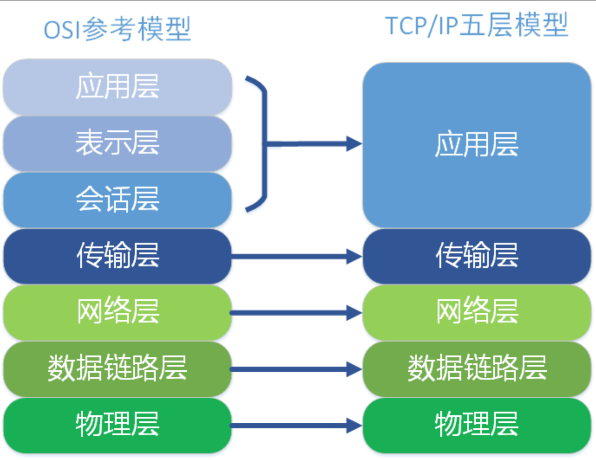

# **什么是网络协议**

## 	**《网络协议详细概念讲解》** 

一、网络协议的定义 网络协议是计算机网络中进行数据交换而建立的规则、标准或约定。它规定了通信双方在数据传输过程中的各种行为和格式，确保不同设备之间能够准确、高效地进行通信和交互。

二、网络协议的作用 

			1. 实现设备间的通信   - 不同类型的计算机、服务器、路由器、交换机等设备需要通过网络协议来理解彼此发送的数据。网络协议定义了数据的格式、编码方式、传输顺序等，使得设备能够正确地解析和处理接收到的数据。   - 例如，当一台计算机向另一台计算机发送电子邮件时，需要使用 SMTP（Simple Mail Transfer Protocol，简单邮件传输协议）等协议来确保邮件能够准确地传输和被接收方正确地读取。 
			1. 保证数据的可靠性和完整性   - 网络协议通常包含一些机制来保证数据在传输过程中的可靠性和完整性。例如，TCP（Transmission Control Protocol，传输控制协议）通过确认、重传、校验和等机制来确保数据的准确传输，即使在网络出现故障或丢包的情况下也能保证数据的完整性。   - 数据链路层的协议如以太网协议，通过 CRC（Cyclic Redundancy Check，循环冗余校验）等方式来检测数据在物理传输过程中的错误。
			1. 进行流量控制和拥塞控制   - 网络协议可以对数据传输的速度进行控制，以避免网络拥塞和数据丢失。例如，TCP 协议通过滑动窗口机制来进行流量控制，根据接收方的处理能力和网络状况调整发送方的数据发送速度。   - 在网络拥塞时，协议可以采取一些措施来缓解拥塞，如降低发送速度、调整路由等。
			1. 实现网络的管理和安全   - 网络协议可以用于网络的管理和监控，例如 SNMP（Simple Network Management Protocol，简单网络管理协议）可以让管理员远程监控和管理网络设备的状态。   - 安全协议如 SSL/TLS（Secure Sockets Layer/Transport Layer Security，安全套接层/传输层安全协议）可以为网络通信提供加密和认证等安全保障，防止数据被窃取或篡改。 

三、网络协议的分类 

 	1. 按层次划分   
 	 - 物理层协议：主要定义了物理介质的电气、机械和功能特性，如以太网的物理层协议规定了电缆的类型、信号的编码方式等。   
 	 - 数据链路层协议：负责在相邻节点之间进行数据帧的传输和错误检测，如以太网协议、PPP（Point-to-Point Protocol，点到点协议）等。   
 	 - 网络层协议：主要负责网络中的寻址和路由选择，将数据包从源节点传输到目的节点，如 IP（Internet Protocol，互联网协议）等。
 	 - 传输层协议：为应用程序提供端到端的通信服务，确保数据的可靠传输，如 TCP 和 UDP（User Datagram Protocol，用户数据报协议）。   
 	 - 应用层协议：为各种应用程序提供特定的服务，如 HTTP（Hypertext Transfer Protocol，超文本传输协议）、FTP（File Transfer Protocol，文件传输协议）、SMTP 等。 
 	2. 按功能划分   -
 	 	1.  寻址协议：用于确定网络中设备的地址，如 IP 地址和 MAC（Media Access Control，媒体访问控制）地址。   - 
 	 	2. 路由协议：用于确定数据包在网络中的传输路径，如 OSPF（Open Shortest Path First，开放式最短路径优先）、BGP（Border Gateway Protocol，边界网关协议）等。   - 
 	 	3. 传输协议：负责数据的可靠传输，如 TCP 和 UDP。   - 应用协议：为特定的应用程序提供服务，如 HTTP、FTP、SMTP 等。 

四、网络协议的组成要素 

	1. 语法   - 语法规定了数据的格式和结构，包括数据的编码方式、字段的长度和顺序等。例如，在 HTTP 协议中，请求和响应消息都有特定的格式，包含请求方法、URL、协议版本、头部字段和消息体等部分。 
	2.  语义   - 语义规定了数据的含义和操作，即通信双方对数据的理解和解释。例如，在 TCP 协议中，SYN（Synchronize Sequence Numbers，同步序列号）标志位表示请求建立连接，ACK（Acknowledgment，确认）标志位表示确认收到数据。 
	3. 时序   - 时序规定了通信双方的操作顺序和时间关系，包括数据的发送和接收顺序、超时时间的设置等。例如，在 TCP 的三次握手过程中，通信双方需要按照特定的顺序发送和接收 SYN 和 ACK 报文，以建立连接。 

五、网络协议的发展历程 

​	随着计算机网络的发展，网络协议也在不断地演进和完善。早期的网络协议主要是为了满足特定的应用需求而设计的，如 ARPANET 上的 NCP（Network Control Protocol，网络控制协议）。后来，随着互联网的发展，TCP/IP 协议簇逐渐成为主流，它具有开放性、灵活性和可扩展性等优点，能够适应不同的网络环境和应用需求。 近年来，随着移动互联网、物联网、云计算等新兴技术的发展，网络协议也在不断地创新和改进。例如，为了适应移动设备的特点，出现了一些专门针对移动网络的协议，如 Mobile IP（移动 IP）；为了实现物联网设备之间的通信，出现了一些低功耗、短距离的通信协议，如 ZigBee、Bluetooth Low Energy 等。 

六、网络协议的未来发展趋势 

	1. 智能化   - 随着人工智能技术的发展，网络协议将越来越智能化。例如，协议可以自动学习网络的状态和用户的行为，优化数据传输路径和流量控制策略，提高网络的性能和效率。
	1. 安全性   - 随着网络安全威胁的不断增加，网络协议的安全性将成为未来发展的重点。协议将采用更加先进的加密和认证技术，防止数据被窃取和篡改，保障网络的安全。 
	1. 可扩展性   - 随着网络规模的不断扩大和新应用的不断涌现，网络协议需要具有良好的可扩展性。协议将采用模块化的设计，方便添加新的功能和特性，以适应不同的网络环境和应用需求。
	1. 融合性   - 未来的网络协议将越来越融合多种技术，如软件定义网络（SDN）、网络功能虚拟化（NFV）、5G 等。协议将与这些技术相结合，实现网络的智能化、灵活化和高效化。 

**总之，网络协议是计算机网络的基础，它的发展和完善对于推动网络技术的进步和应用的创新具有重要意义。随着科技的不断发展，网络协议将不断地演进和创新，为人们提供更加高效、安全、智能的网络通信服务。**





**TCP**

```c#
//服务端
using System;
using System.Net;
using System.Net.Sockets;
using System.Text;
using System.Windows.Forms;

namespace TcpServer
{
    public partial class ServerForm : Form
    {
        private TcpListener listener;
        private TcpClient client;
        private NetworkStream stream;

        public ServerForm()
        {
            InitializeComponent();
        }

        private void StartServer_Click(object sender, EventArgs e)
        {
            try
            {
                listener = new TcpListener(IPAddress.Any, 8888);
                listener.Start();
                LogBox.AppendText("服务器启动，等待客户端连接...\n");

                client = listener.AcceptTcpClient();
                stream = client.GetStream();

                LogBox.AppendText("客户端已连接。\n");

                byte[] buffer = new byte[1024];
                int bytesRead;

                while ((bytesRead = stream.Read(buffer, 0, buffer.Length)) > 0)
                {
                    string message = Encoding.ASCII.GetString(buffer, 0, bytesRead);
                    LogBox.AppendText($"收到客户端消息：{message}\n");
                }
            }
            catch (Exception ex)
            {
                LogBox.AppendText($"错误：{ex.Message}\n");
            }
            finally
            {
                if (stream!= null) stream.Close();
                if (client!= null) client.Close();
                if (listener!= null) listener.Stop();
            }
        }
    }
}
```

```c#
// 客户端
using System;
using System.Net.Sockets;
using System.Text;
using System.Windows.Forms;

namespace TcpClient
{
    public partial class ClientForm : Form
    {
        private TcpClient client;
        private NetworkStream stream;

        public ClientForm()
        {
            InitializeComponent();
        }

        private void SendMessage_Click(object sender, EventArgs e)
        {
            try
            {
                client = new TcpClient("127.0.0.1", 8888);
                stream = client.GetStream();

                byte[] data = Encoding.ASCII.GetBytes(MessageBox.Text);
                stream.Write(data, 0, data.Length);

                LogBox.AppendText($"发送消息：{MessageBox.Text}\n");
            }
            catch (Exception ex)
            {
                LogBox.AppendText($"错误：{ex.Message}\n");
            }
            finally
            {
                if (stream!= null) stream.Close();
                if (client!= null) client.Close();
            }
        }
    }
}
```


**UDP**

```c#
// 服务端
using System;
using System.Net;
using System.Net.Sockets;
using System.Text;
using System.Windows.Forms;

namespace UdpServer
{
    public partial class ServerForm : Form
    {
        private UdpClient listener;

        public ServerForm()
        {
            InitializeComponent();
        }

        private void StartServer_Click(object sender, EventArgs e)
        {
            try
            {
                listener = new UdpClient(8888);
                LogBox.AppendText("服务器启动，等待消息...\n");

                IPEndPoint remoteEP = null;
                byte[] buffer;

                while (true)
                {
                    buffer = listener.Receive(ref remoteEP);
                    string message = Encoding.ASCII.GetString(buffer);
                    LogBox.AppendText($"收到来自 {remoteEP.Address}:{remoteEP.Port} 的消息：{message}\n");
                }
            }
            catch (Exception ex)
            {
                LogBox.AppendText($"错误：{ex.Message}\n");
            }
            finally
            {
                if (listener!= null) listener.Close();
            }
        }
    }
}		
```

```c#
//客户端
using System;
using System.Net;
using System.Net.Sockets;
using System.Text;
using System.Windows.Forms;

namespace UdpClient
{
    public partial class ClientForm : Form
    {
        private UdpClient client;

        public ClientForm()
        {
            InitializeComponent();
        }

        private void SendMessage_Click(object sender, EventArgs e)
        {
            try
            {
                client = new UdpClient();
                byte[] data = Encoding.ASCII.GetBytes(MessageBox.Text);
                client.Send(data, data.Length, "127.0.0.1", 8888);
                LogBox.AppendText($"发送消息：{MessageBox.Text}\n");
            }
            catch (Exception ex)
            {
                LogBox.AppendText($"错误：{ex.Message}\n");
            }
            finally
            {
                if (client!= null) client.Close();
            }
        }
    }
}
```


HTTP