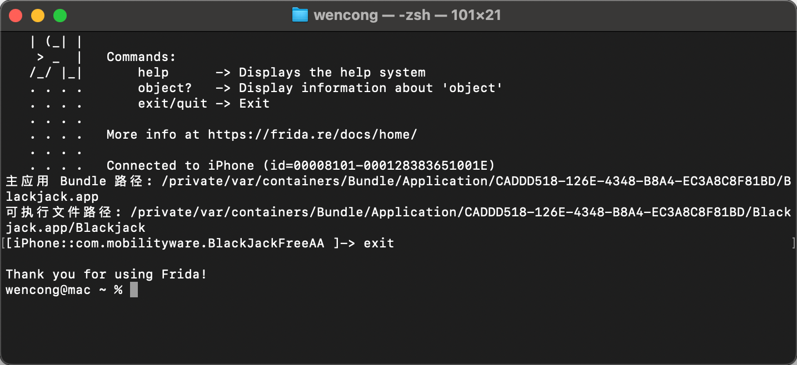

## 获取执行目录

[脚本](./js/frida_script.js)



```bash
# 是否连接上手机
idevice_id -l
# 查找手机上app程序
/Users/wencong/.local/bin/frida-ps -Uai 
/Users/wencong/.local/bin/frida-ls-devices
#    -  黑杰克_xyz          com.mobilityware.BlackJackFreeAA  
#    -  同仁棋牌             dffd.vafe.fawe   

/Users/wencong/.local/bin/frida -U -N com.mobilityware.BlackJackFreeAA -l /Users/wencong/project/frontier/docsify/docs/re/js/frida_script1.js

// 获取主应用的 bundle 路径
const mainBundlePath = ObjC.classes.NSBundle.mainBundle().bundlePath().toString();
console.log("主应用 Bundle 路径:", mainBundlePath);

// 获取主应用的可执行文件路径
const executablePath = ObjC.classes.NSBundle.mainBundle().executablePath().toString();
console.log("可执行文件路径:", executablePath);

```

脚本内容

```js
// getAppPath.js
'use strict';

console.log("开始获取应用路径信息...");

// 方法一：通过 NSBundle 获取主应用路径
function getNSBundlePath() {
  try {
      const mainBundlePath = ObjC.classes.NSBundle.mainBundle().bundlePath().toString();
      const executablePath = ObjC.classes.NSBundle.mainBundle().executablePath().toString();
      console.log("\n=== 方法一：通过 NSBundle ===");
      console.log("主应用 Bundle 路径:", mainBundlePath);
      console.log("可执行文件路径:", executablePath);
  } catch (e) {
      console.error("方法一错误:", e);
  }
}

// 方法二：通过 NSProcessInfo 获取进程信息
function getNSProcessInfoPath() {
  try {
      const processInfo = ObjC.classes.NSProcessInfo.processInfo();
      const processName = processInfo.processName().toString();
      const argumentsDist = processInfo.arguments();
      
      console.log("\n=== 方法二：通过 NSProcessInfo ===");
      console.log("进程名称:", processName);
      console.log("启动参数数量:", argumentsDist.count());
      
      // 正确访问 NSArray 的方式
      if (argumentsDist.count() > 0) {
          // 方法1：使用 objectAtIndex() 方法
          const executablePath = argumentsDist.objectAtIndex_(0).toString();
          
          console.log("可执行文件路径:", executablePath);
      }
  } catch (e) {
      console.error("方法二错误:", e);
  }
}

// 方法三：获取特定类所在的框架路径
function getUIKitPath() {
  try {
      // 示例：获取 UIKit 框架路径
      const uiKitClass = ObjC.classes.UIView;
      const uiKitPath = ObjC.classes.NSBundle.bundleForClass_(uiKitClass).bundlePath().toString();
      
      // 示例：获取应用主类所在路径（如果知道主类名）
      const appDelegateClass = ObjC.classes.AppDelegate; // 替换为实际的 AppDelegate 类名
      const appDelegatePath = ObjC.classes.NSBundle.bundleForClass_(appDelegateClass).bundlePath().toString();
      
      console.log("\n=== 方法三：获取特定类所在框架 ===");
      console.log("UIKit 框架路径:", uiKitPath);
      console.log("AppDelegate 所在路径:", appDelegatePath);
  } catch (e) {
      console.error("方法三错误:", e);
  }
}

console.log("\n应用路径信息获取完成！");

// 获取执行目录
getNSBundlePath();

```

